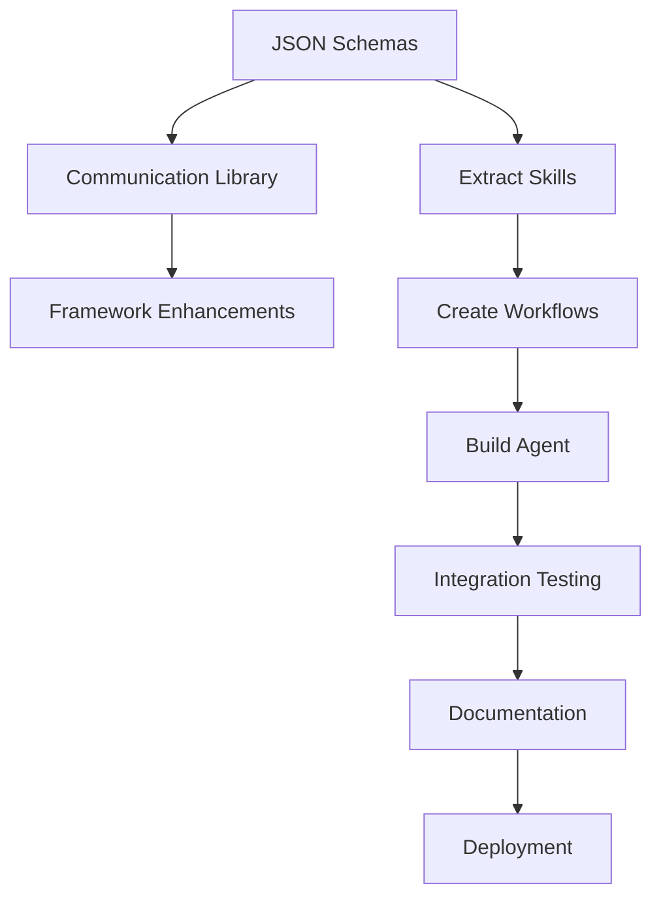

# Implementation Priorities & Timeline

**Date:** November 1, 2025
**Version:** 1.0.0

---

## Overview

This document defines implementation priorities, timeline, and resource allocation for the security agent integration project.

---

## Priority Levels

**High Priority**: Critical for core functionality, blocks other work
**Medium Priority**: Important but not blocking, enhances functionality
**Low Priority**: Nice to have, polish and optimization

---

## Week 1: Core Infrastructure & Security Agent Functional

### High Priority Tasks

#### Day 1-2: JSON Schemas and Validation (8-16 hours)

**Owner**: Backend Engineer
**Blockers**: None

**Tasks**:
1. Create `agent-output-schema.json` (2h)
2. Create `security-findings-schema.json` (2h)
3. Create `inter-agent-message-schema.json` (2h)
4. Implement `schema_validator.py` (4h)
5. Write unit tests (4h)
6. Documentation (2h)

**Deliverables**:
- ✅ All schema files
- ✅ Validation library
- ✅ Unit tests (>90% coverage)

**Success Criteria**:
- Schemas validate correctly
- Library can validate sample outputs
- All tests passing

---

#### Day 3-4: Communication Library (8-16 hours)

**Owner**: Backend Engineer
**Blockers**: Schemas completed

**Tasks**:
1. Implement `AgentMessenger` class (4h)
2. Implement `create_agent_output()` helper (2h)
3. File-based message queue (4h)
4. Write unit tests (4h)
5. Documentation (2h)

**Deliverables**:
- ✅ `agent_communication.py`
- ✅ Message passing functional
- ✅ Unit tests

**Success Criteria**:
- Agents can send/receive messages
- Output creation works
- Tests passing

---

#### Day 5-7: Extract Security Skills (12-24 hours)

**Owner**: Security Engineer + Backend Engineer
**Blockers**: Phase 1 completed

**Tasks**:
1. Extract `mobile_xss_scanner.py` (3h)
2. Extract `csrf_validator.py` (3h)
3. Extract `cors_checker.py` (2h)
4. Extract `csp_analyzer.py` (2h)
5. Extract `typescript_standards_checker.py` (4h)
6. Extract `python_standards_checker.py` (4h)
7. Extract `dead_code_detector.py` (4h)
8. Unit tests for all skills (8h)

**Deliverables**:
- ✅ 7 modular skills
- ✅ Unit tests for each
- ✅ Documentation

**Success Criteria**:
- Each skill works independently
- Tests passing (>85% coverage)
- Consistent output format

---

### Week 1 Summary

**Total Effort**: 28-56 hours (3.5-7 days for 1-2 engineers)
**Key Milestone**: All skills extracted and tested

---

## Week 2: Integration & Testing

### High Priority Tasks

#### Day 8-9: Create Workflows & Build Agent (8-16 hours)

**Owner**: Backend Engineer
**Blockers**: Skills completed

**Tasks**:
1. Create 4 workflow YAML files (2h)
2. Implement `SecurityMonitoringAgent` class (8h)
3. Implement output conversion logic (4h)
4. Implement helper methods (2h)

**Deliverables**:
- ✅ 4 workflows
- ✅ Security agent implementation
- ✅ Output conversion

**Success Criteria**:
- Workflows load correctly
- Agent executes workflows
- Output validates against schema

---

#### Day 10: Create Agent Specification (4-8 hours)

**Owner**: Technical Writer + Engineer
**Blockers**: Agent implementation

**Tasks**:
1. Create MD file with YAML frontmatter (2h)
2. Write comprehensive system prompt (4h)
3. Document capabilities and examples (2h)

**Deliverables**:
- ✅ `security_monitoring_agent.md`
- ✅ Complete documentation

**Success Criteria**:
- YAML valid
- System prompt comprehensive
- Examples clear

---

### Medium Priority Tasks

#### Day 11-12: Framework Enhancements (8-16 hours)

**Owner**: Framework Engineer
**Blockers**: Communication library completed

**Tasks**:
1. Add schema support to `ModularAgent` (3h)
2. Add communication methods (3h)
3. Add artifact management (2h)
4. Update documentation (4h)
5. Update existing agents (4h)

**Deliverables**:
- ✅ Enhanced framework
- ✅ Updated docs
- ✅ Migration guide

**Success Criteria**:
- All agents can use new features
- Backward compatible
- Documentation complete

---

#### Day 13-14: Integration Testing & Documentation (8-16 hours)

**Owner**: QA Engineer + Technical Writer
**Blockers**: Agent and framework complete

**Tasks**:
1. Write integration tests (6h)
2. Test end-to-end workflows (4h)
3. Test inter-agent communication (2h)
4. Create user documentation (4h)
5. Create migration guide (4h)

**Deliverables**:
- ✅ Integration test suite
- ✅ User documentation
- ✅ Migration guide

**Success Criteria**:
- All workflows tested
- Integration tests passing
- Documentation complete

---

### Week 2 Summary

**Total Effort**: 28-56 hours (3.5-7 days for 2-3 engineers)
**Key Milestone**: Security agent fully integrated and tested

---

## Week 3: Polish & Deployment

### Low Priority Tasks

#### Day 15-16: Report Migration & Tools (8-16 hours)

**Owner**: Backend Engineer
**Blockers**: Agent functional

**Tasks**:
1. Create config migration script (3h)
2. Create report migration script (3h)
3. Test migrations (4h)
4. Documentation (2h)

**Deliverables**:
- ✅ Migration scripts
- ✅ Migration documentation

**Success Criteria**:
- Old configs convert to new format
- Old reports convert to new schema
- Scripts tested and documented

---

#### Day 17-18: CI/CD Integration Examples (8-16 hours)

**Owner**: DevOps Engineer
**Blockers**: Agent functional

**Tasks**:
1. GitHub Actions workflow (3h)
2. GitLab CI example (2h)
3. Jenkins pipeline example (2h)
4. Pre-commit hook example (2h)
5. Documentation (3h)

**Deliverables**:
- ✅ CI/CD examples
- ✅ Hook examples
- ✅ Integration guide

**Success Criteria**:
- Examples working
- Documentation clear
- Easy to adapt

---

#### Day 19-21: Performance Optimization & Polish (12-24 hours)

**Owner**: Performance Engineer
**Blockers**: All testing complete

**Tasks**:
1. Profile skill execution (4h)
2. Optimize file scanning (4h)
3. Implement caching (4h)
4. Test parallel execution (4h)
5. Benchmark and compare (4h)
6. Documentation updates (4h)

**Deliverables**:
- ✅ Performance improvements
- ✅ Benchmarks
- ✅ Optimization docs

**Success Criteria**:
- No performance regression
- Improvements documented
- Benchmarks showing gains

---

### Week 3 Summary

**Total Effort**: 28-56 hours (3.5-7 days for 2-3 engineers)
**Key Milestone**: Production-ready with CI/CD integration

---

## Resource Allocation

### Team Composition

**Minimum Team**:
- 1 Senior Backend Engineer (Weeks 1-3)
- 1 Security Engineer (Week 1)
- 1 QA Engineer (Week 2)

**Optimal Team**:
- 1 Senior Backend Engineer (Weeks 1-3)
- 1 Backend Engineer (Weeks 1-2)
- 1 Security Engineer (Week 1)
- 1 Framework Engineer (Week 2)
- 1 QA Engineer (Week 2)
- 1 Technical Writer (Weeks 2-3)
- 1 DevOps Engineer (Week 3)
- 1 Performance Engineer (Week 3)

### Time Allocation

| Week | Minimum Team | Optimal Team |
|------|--------------|--------------|
| Week 1 | 56-80 hours | 35-50 hours |
| Week 2 | 56-80 hours | 35-50 hours |
| Week 3 | 28-40 hours | 20-30 hours |
| **Total** | **140-200 hours** | **90-130 hours** |

---

## Dependencies & Blockers

### Critical Dependencies



### Potential Blockers

1. **Schema Design Disagreements**
   - **Mitigation**: Early review and approval
   - **Owner**: Tech Lead

2. **Skill Extraction Complexity**
   - **Mitigation**: Pair programming
   - **Owner**: Senior Engineer

3. **Test Environment Issues**
   - **Mitigation**: Set up early
   - **Owner**: DevOps

4. **Integration Conflicts**
   - **Mitigation**: Frequent integration
   - **Owner**: Team

---

## Risk Matrix

| Risk | Probability | Impact | Mitigation |
|------|-------------|--------|------------|
| Schema changes required | Medium | High | Early validation |
| Performance regression | Low | High | Continuous benchmarking |
| Integration failures | Medium | Medium | Extensive testing |
| Resource unavailability | Medium | High | Cross-training |
| Scope creep | High | Medium | Strict prioritization |

---

## Parallel Work Streams

### Stream 1: Infrastructure (Week 1)
- Schemas
- Validation
- Communication

### Stream 2: Skills (Week 1-2)
- Extract skills
- Write tests
- Document

### Stream 3: Integration (Week 2)
- Build agent
- Framework updates
- Integration tests

### Stream 4: Polish (Week 3)
- Migration tools
- CI/CD examples
- Performance

**Streams 1 & 2 can run in parallel**
**Streams 3 & 4 are sequential**

---

## Daily Standup Format

### Questions to Answer

1. **Yesterday**: What did you complete?
2. **Today**: What will you work on?
3. **Blockers**: Any issues blocking progress?
4. **Help Needed**: Do you need assistance?

### Progress Tracking

Use this checklist in daily standups:

**Week 1**:
- [ ] Schemas created
- [ ] Validation working
- [ ] Communication library functional
- [ ] Skill 1-2 extracted
- [ ] Skill 3-4 extracted
- [ ] Skill 5-6 extracted
- [ ] Skill 7 extracted
- [ ] All skill tests passing

**Week 2**:
- [ ] Workflows created
- [ ] Agent implementation started
- [ ] Agent functional
- [ ] Agent spec created
- [ ] Framework enhanced
- [ ] Integration tests written
- [ ] All tests passing

**Week 3**:
- [ ] Migration tools created
- [ ] CI/CD examples done
- [ ] Performance optimization complete
- [ ] Documentation complete
- [ ] Ready for deployment

---

## Deployment Strategy

### Phase 1: Alpha (End of Week 2)
- Internal testing only
- Select team members
- Feedback collection

### Phase 2: Beta (End of Week 3)
- Limited rollout
- 2-3 projects
- Monitor closely

### Phase 3: General Availability (Week 4)
- Full rollout
- Deprecate old agent
- Support transition

---

## Success Metrics

### Development Metrics

- **Code Coverage**: >85%
- **Test Pass Rate**: 100%
- **Documentation Coverage**: 100%
- **Performance**: No regression

### Adoption Metrics

- **Week 4**: 25% adoption
- **Week 8**: 50% adoption
- **Week 12**: 75% adoption
- **Week 16**: 100% adoption

### Quality Metrics

- **Bug Rate**: <5 per week after launch
- **False Positive Rate**: <5%
- **User Satisfaction**: >4/5 rating

---

## Communication Plan

### Stakeholder Updates

**Weekly Updates**:
- Progress summary
- Blockers and resolutions
- Next week's plan
- Risk updates

**Audience**:
- Engineering leadership
- Product management
- Security team
- DevOps team

### Team Communication

**Daily Standups**: 15 minutes
**Weekly Retrospectives**: 30 minutes
**Ad-hoc Sync**: As needed

**Channels**:
- Slack: #security-agent-integration
- Email: security-agent-team@company.com
- Wiki: Confluence page

---

## Rollout Checklist

Before declaring "Done":

### Technical Readiness
- [ ] All tests passing
- [ ] Performance benchmarks met
- [ ] Security review completed
- [ ] Documentation complete
- [ ] Migration tools tested

### Operational Readiness
- [ ] Team trained
- [ ] Support process defined
- [ ] Monitoring in place
- [ ] Rollback plan tested
- [ ] Runbook created

### User Readiness
- [ ] User guide published
- [ ] Migration guide available
- [ ] Examples working
- [ ] FAQ created
- [ ] Support available

---

## Post-Launch Plan

### Week 1 After Launch
- Daily monitoring
- Quick bug fixes
- User support
- Feedback collection

### Week 2-4 After Launch
- Feature requests review
- Performance optimization
- Documentation updates
- Training sessions

### Month 2-3 After Launch
- Deprecate old agent
- Remove old code
- Long-term improvements
- Lessons learned doc

---

## Budget Estimate

### Engineering Time

| Role | Hours | Rate | Cost |
|------|-------|------|------|
| Senior Engineer | 120 | $150/hr | $18,000 |
| Backend Engineer | 80 | $120/hr | $9,600 |
| Security Engineer | 40 | $130/hr | $5,200 |
| QA Engineer | 40 | $100/hr | $4,000 |
| DevOps Engineer | 24 | $110/hr | $2,640 |
| Technical Writer | 32 | $90/hr | $2,880 |
| **Total** | **336** | | **$42,320** |

### Infrastructure

| Item | Cost |
|------|------|
| Testing environments | $500 |
| CI/CD resources | $300 |
| Monitoring tools | $200 |
| **Total** | **$1,000** |

### **Grand Total**: **$43,320**

---

## Approval & Sign-Off

### Required Approvals

- [ ] Engineering Manager
- [ ] Tech Lead
- [ ] Security Lead
- [ ] Product Manager
- [ ] DevOps Lead

### Sign-Off Date

**Target**: November 8, 2025

### Go/No-Go Decision

**Date**: November 15, 2025 (after Week 2)

**Criteria**:
- All high-priority tasks complete
- Integration tests passing
- No critical blockers
- Performance acceptable

---

## Appendix: Task Board

### Kanban Board Structure

**Columns**:
1. Backlog
2. Ready
3. In Progress
4. Review
5. Testing
6. Done

**Labels**:
- Priority: High/Medium/Low
- Type: Infrastructure/Skill/Integration/Docs
- Week: Week1/Week2/Week3

### Example Tasks

```
[High][Infrastructure][Week1] Create JSON schemas
[High][Skill][Week1] Extract XSS scanner skill
[Medium][Integration][Week2] Add framework enhancements
[Low][Polish][Week3] Optimize performance
```

---

## Questions & Answers

**Q: Can we compress the timeline?**
A: Yes, with more resources in parallel work streams.

**Q: What if we hit a blocker?**
A: Escalate immediately, adjust timeline, consider alternatives.

**Q: Can we skip documentation?**
A: No, documentation is critical for adoption and maintenance.

**Q: What's the minimum viable product?**
A: Functional security agent with JSON output and basic workflows.

**Q: When can we deprecate the old agent?**
A: After 100% adoption, approximately Week 16.

---

## Next Steps

1. **Review this plan** with all stakeholders
2. **Get approvals** from required parties
3. **Allocate resources** and confirm availability
4. **Set up infrastructure** (repos, boards, channels)
5. **Kick off Week 1** work
6. **Daily standups** starting Day 1
7. **Weekly reviews** every Friday
